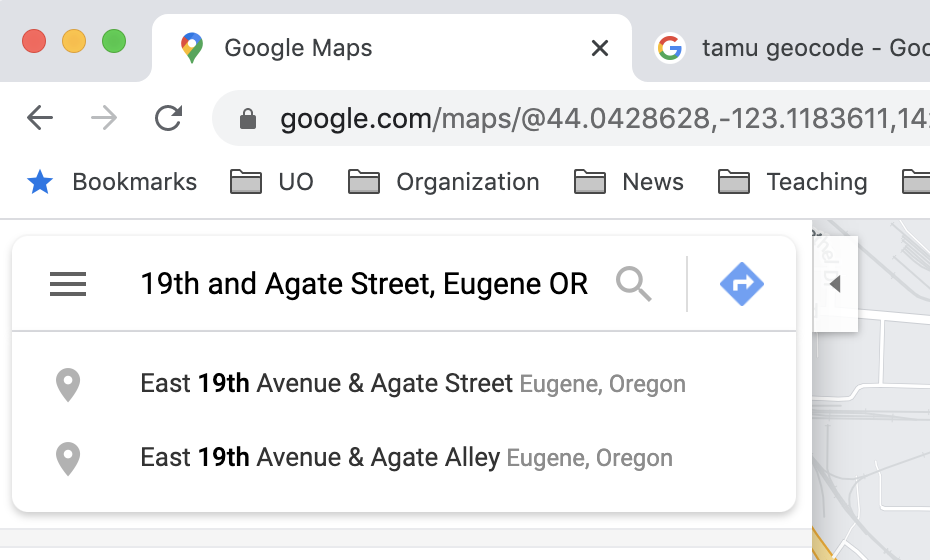
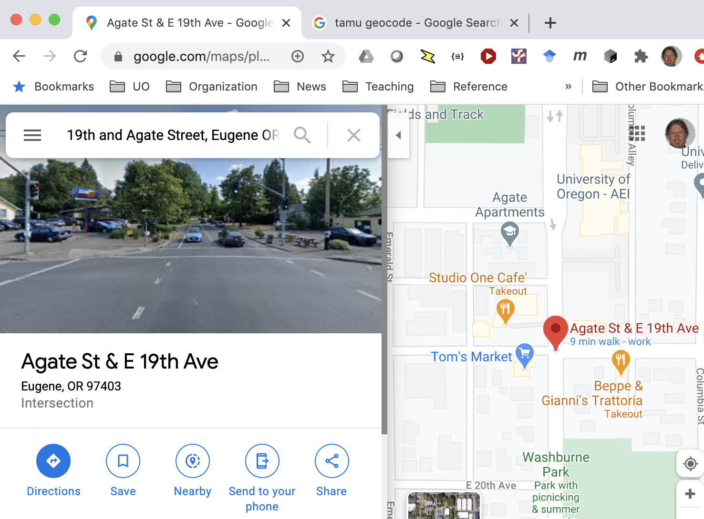
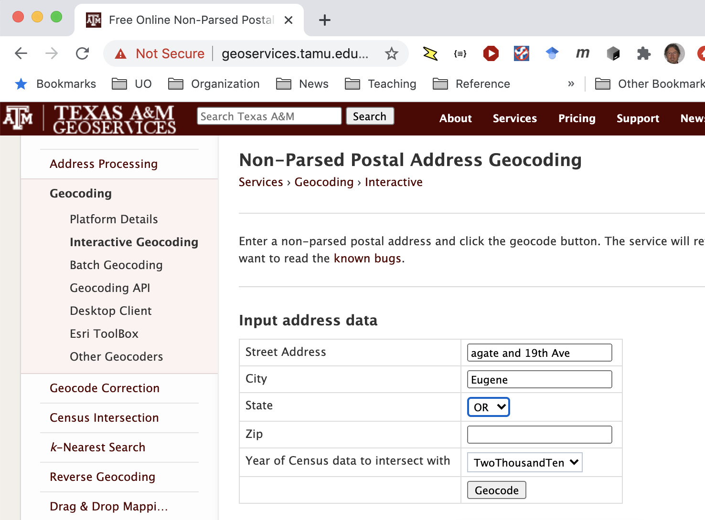
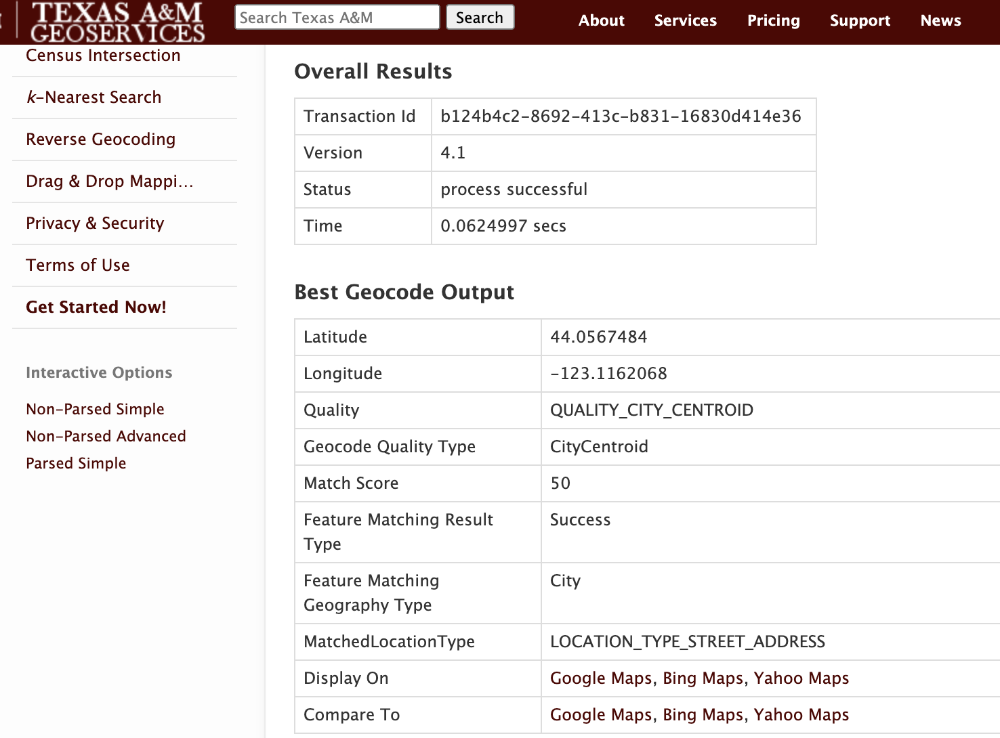
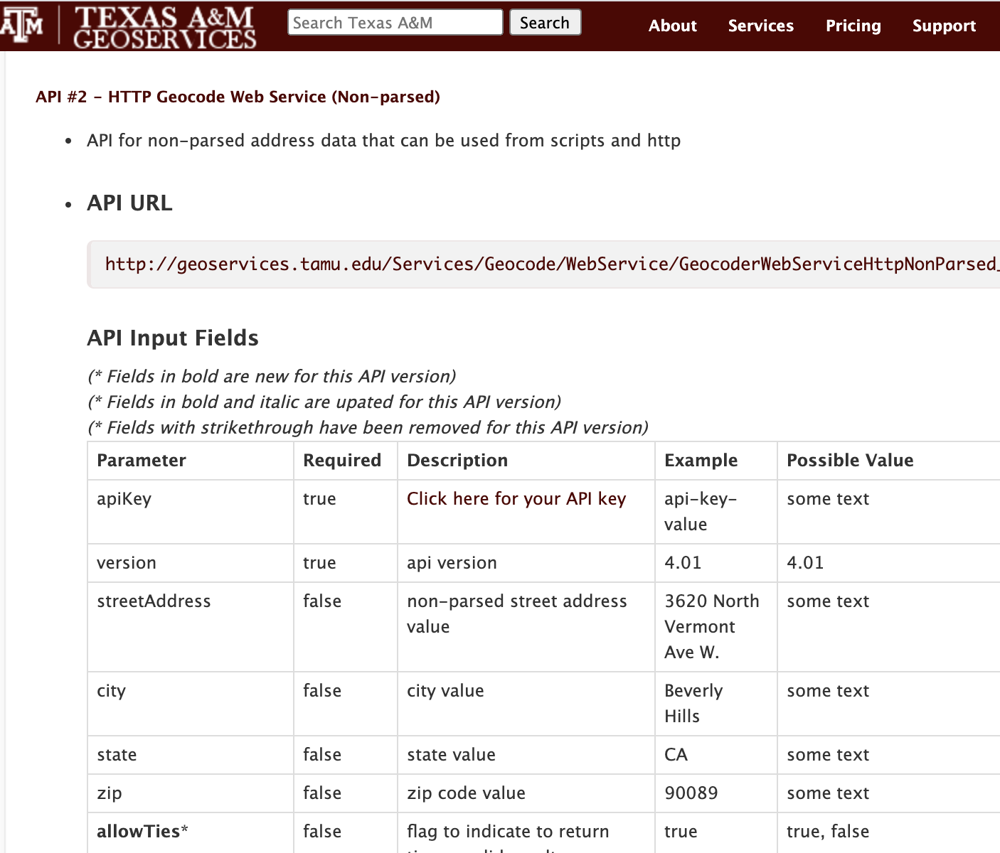
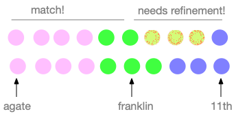

## Overview 

Hikers, runners, and cyclists often record their 
activites using a phone, fitness watch, or dedicated GPS device.  They may upload data from their devices to a system like Strava, MapMyRun, or RideWithGPS, which typically provide analysis, map display, and optional social media sharing.  

Existing services like Strava provide a variety of analyses and record keeping, but they typically do not provide a fully automated way to extract turn-by-turn directions from a recorded activity.  For hikers and runners and some cyclists who travel off-road, this might be very difficult ... there may be no suitable database from which to extract suitable cues.  For road cyclists, however, it should be possible to extract turn-by-turn directions (a "cue sheet") from a recording.  

That is what our system will do.  The input will be a record consisting of a sequence of (latitude, longitude) pairs, possibly with other information.  The output should be a list of turn-by-turn directions, e.g., 

* 0.0 km Start at 19th and Agate
* 1.2km Left on Franklin Blvd
* 1.4km Left on 11th Ave

etc   

## Background

### Basic terms

#### Geocoding

Geocoding means translating place names or descriptions into geographic coordinates, usually latitude and longitude. If you have used a web mapping service, you have probably used geocoding to find a destination or place of interest. 



The mapping service first geocodes the location description ("19th and Agate Street, Eugene OR" in this example), and then displays the area around that location.  



It is also possible to use a geocoding service without the map display.  A research group at Texas A&M University offers one such geocoding service.  

 

The TAMU geocoding service returns latitude and longitude, as well as some additional information about the search result. 



In addition to the interactive web application, TAMU offers its
service as a _web service_. 

#### Reverse Geocoding

Geocoding translates addresses into coordinates.  Reverse geocoding, as you might guess, translates coordinates to addresses.  This involves some very cool data structures and algorithms called spatial indexes, but you don't need to understand spatial indexes to use a reverse geocoding service. The same research group at Texas A&M offers a reverse geocoding web service. 

#### Web Services

A web application (or "web app") is designed for use by humans. A _web service_ is designed for use by programs.  Often it will be called a "web api" or just "api" (application program interface).  Sometimes it will be called a REST API or REST service.  _REST_ stands for "representational state transfer", and describes an _architectural style_ for web services and web applications.  We'll discuss software architectural styles in the second half of CIS 422. 

A RESTful API for a web service  is similar to a library interface, except that 
web (http protocol) requests take the place of function calls. 



If you imagine the service was a Python function, the name of the function would be `http://geoservices.tamu.edu/Services/Geocode/WebService/GeocoderWebServiceHttpNonParsed_V04_01.aspx?`  and each parameter would be an argument.  We make the function call by sending an http request.  One way to send an http request is by typing it in the URL bar of a browser.  For example, if we type

```
https://geoservices.tamu.edu/Services/Geocode/WebService/GeocoderWebServiceHttpNonParsed_V04_01.aspx?streetAddress=9355%20Burton%20Way&city=Beverly%20Hills&state=ca&zip=90210&apikey=123456789abcdef&format=csv&census=true&censusYear=2000|2010&notStore=false&version=4.01
```
 
in the URL bar, substituting a valid api key for `123456789abcdef`, the result will 
be 

```
0838148b-ee72-4ab8-aa8a-0359968e3a4c,4.1,200,34.0724312845563,-118.397420607361,03,StreetSegmentInterpolation,100,Exact,Success,1,StreetSegment,5189.80266814376,Meters,LOCATION_TYPE_STREET_ADDRESS,0.0312543,1,ResidenceStreetAddress,4021,4,7008.00,037,31100,0,91750,31084,4472,44000,06,1023,1,7008.01,037,31100,0,91750,31084,4472,44000,06,
```

This is not a very usable interface for humans, but it is fine for software.  The Python `requests` library is especially nice for working with this kind of API. 

### Tracks

Runners, hikers, and cyclists often use GPS devices to log their 
outings.  The GPS device might be a mobile phone, a fitness watch like those from Apple, Fitbit, and Garmin, or a cycling computer like the Garmin Edge series or the Wahoo Elemnt series.
Many people log their activities to a web application like 
MapMyRun or Strava. A record that includes a series of locations along with time, often with additional data such as heart rate, is called a _track_. 

Tracks may be stored in any of several formats.  Many web applications support downloading tracks in the _GPX_ format. 
GPX is an XML encoding, and looks like this: 

```
<?xml version="1.0" encoding="UTF-8"?>
<gpx xmlns:xsi="http://www.w3.org/2001/XMLSchema-instance" xmlns="http://www.topografix.com/GPX/1/1" xmlns:gpxdata="http://www.cluetrust.com/XML/GPXDATA/1/0" xsi:schemaLocation="http://www.topografix.com/GPX/1/1 http://www.topografix.com/GPX/1/1/gpx.xsd http://www.cluetrust.com/XML/GPXDATA/1/0 http://www.cluetrust.com/Schemas/gpxdata10.xsd" version="1.1" creator="http://ridewithgps.com/">
  <metadata>
    <name>09/27/20</name>
    <link href="https://ridewithgps.com/trips/56855290">
      <text>09/27/20</text>
    </link>
    <time>2020-09-27T11:31:19Z</time>
  </metadata>
  <trk>
    <name>09/27/20</name>
    <trkseg>
      <trkpt lat="44.587662" lon="-123.256691">
        <ele>67.3999999</ele>
        <time>2020-09-27T18:31:19Z</time>
      </trkpt>
      <trkpt lat="44.587662" lon="-123.256691">
        <ele>67.3999999</ele>
        <time>2020-09-27T18:31:20Z</time>
      </trkpt>
      ...
```

The sample above was downloaded from Ride With GPS, a popular
web application for cyclists. Ride With GPS was founded by
an alumnus of University of Oregon together with an alumnus
of Oregon State University.  It is perhaps not coincidental that
the UO alum once participated in a CIS 422 team that built a system to display ride records in Google Maps, before such applications were widely available. 

As you might guess, the GPX format is not designed to be 
very convenient for human readers, but it is easy for 
software to decode.  One example library that can decode and
manipulate GPX files is the `gpxpy` module for Python.

### Geodetic Coordinates: Easting and Northing

It is likely that reverse geocoding a track will
require estimating distances between points.  
Coordinate systems for maps are typically in degrees
latitude and longitude.  If we ask "how far is one 
degree, in miles", the answer is "it depends".  There are ways to determine the distance between a pair of
(latitude, longitude) pairs that involve trigonmetric functions.  The simplest approach, though, is to translate all the points to a coordinate system of meters.  The "UTM" coordinate system is a map 
coordinate system in meters.  The coordinate units are called
 "easting" (x coordinate) and "northing" (y coordinate), relative to
  some origin point.  This works very poorly at the scale of thousands
   of kilometers, because the earth is not actually flat.  Within a range of a few hundred kilometers it works well enough for our purposes.  
There are multiple Python libraries that can convert latitude and longitude to the UTM coordinate system. The `geopy.distance` and `utm` modules have worked well for me. 

## How will it work? 

You could solve this problem in more than one way.  Here are two. 

### Approach 1: Binary search on location text

Initially you have a very long sequence of coordinate pairs indicating points along the route.  Let's imagine that each point.  Two points in the line
have the same color if they are on the same street or road.  For example, 13245 Agate, Eugene OR and 9823 Agate, Eugene OR have the color, but 542 Franklin Blvd has a different color.  


We could detect the turns by reverse geocoding every point along the path, but that would be very inefficient and slow.  Instead, we might start by
reverse geocoding just the first and last points and one point approximately in the middle.  


From here, we consider each adjacent pair of geocoded points.  In this example, the first such pair has colors (agate, franklin).   These are not the same, so we subdivide.


Now the first pair, (agate, agate) are the same color, so we need not subdivide it farther.  The second pair, (agate, franklin) are different colors, so we subdivide again, and so on until we have pinpointed the turn.  The direction of the turn is determined by considering the direction of the last few points before and the first few points  after the turn. 

## Approach 2: Routing and diffing

There is a potentially more efficient way to obtain
a complete set of turn directions, _if_ you can find
a good routing map service that permits this use. 
(Google Maps definitely does not permit it.  I believe
Mapbox does permit it, but you could encounter fees
for the service.)  

Let's start again with our list of points, and divide
it initially into roughly two halves. 


This time, instead of checking whether the start and
end points of each division are on the same street, 
we ask the routing service to give us directions
from the start to the midpoint, and from the midpoint
to the end.  I assume we can obtain not only a list
of turn-by-turn directions, but also points along
the path.  But note, the path returned by the routing
service may be different than the route we are analyzing. 



 If the route returned by the routing service coincides with the corresponding portion of the
recorded track, then we can use that portion of the direction without modification.  If part of the returned route deviates from the recorded track, we can subdivide the mismatched part as before.  This approach
_probably_ requires fewer calls on the routing service than approach 1 requires for reverse geocoding points, both because routing services directly identify the locations of turns, and because sometimes a segment with several turns will match. 

## Other Requirements and Constraints

Your system must be open source, available on GitHub, and easily buildable.  (We'll talk about what that means.) It must not violate the terms and conditions of any libraries or services it uses, nor violate any laws that apply in Oregon.

I want to leave you a lot of freedom to design the system.  You might want to give it a web interface, but a command line interface is also ok.  

Project one should be a _minimal viable product_, with just enough functionality to be useful.  It should above all be a good basis for you or for other developers to build upon.  I would much rather have a minimal system that is a good foundation for further development, than a fancy system that is poorly structured and documented.  


